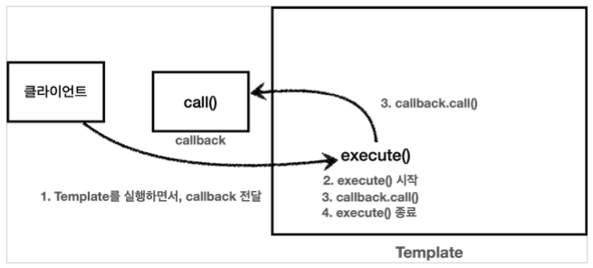

 

# 스프링 핵심 원리 - 고급편 
 

# ThreadLocal
 

### 동시성 문제 
 
  

### ThreadLocal이란
 
  

### ThreadLocal 실험 
#### ThreadLocal 사용 전
 
 
#### ThreadLocal 사용 후 
 
  

### ThreadLocal 사용 시 반드시 주의해야 할 점 
 
 
 
 
  

##### * ThreadLocal에 세션 저장해서 사용하기 
https://velog.io/@skygl/ThreadLocal

    

# 디자인 패턴 
- 디자인패턴은 “의도”(intent)로 구별한다.
- 디자인패턴 => “의도”(intent)가 중요!!
   

## '변하는 것과 변하지 않는 것을 분리'
- 좋은 설계란?
    - 진정한 좋은 설계는 바로 “변경”이 일어날 때 자연스럽게 드러난다.
- 단일 책임 원칙(SRP)
    - 변경이 있을 때 단일 책임 원칙을 잘 지켰는지가 드러난다. 
   

## 템플릿 메서드 패턴
#### 템플릿 메서드 패턴 단점.
자식클래스가 부모클래스의 기능을 사용하지 않음에도 불구하고 
자식클래스가 부모클래스를 의존하고 있다. 
(extends로 부모클래스를 명시하고 있다.)  
"의존" => 부모클래스의 뭔가가 바뀌면 자식도 영향을 받는다는 것. 
 
자식 클래스 입장에서는 부모 클래스의 기능을 전혀 사용하지 않는데 부모 클래스를 알아야한다. 
이것은 좋은 설계가 아니다. 
그리고 이런 잘못된 의존관계 때문에 부모 클래스를 수정하면, 자식 클래스에도 영향을 줄 수 있다. 
 
추가로 템플릿 메서드 패턴은 상속 구조를 사용하기 때문에  
별도의 클래스나 익명 내부 클래스를 만들어야 하는 부분도 복잡하다.  
 
템플릿 메서드 패턴과 비슷한 역할을 하면서 상속의 단점을 제거할 수 있는 디자인 패턴이 바로  
전략 패턴(Strategy Pattern)이다.  
  

## 전략 패턴
#### 1. 필드에 전략을 보관하는 방식
<a href="https://github.com/sombrero104/spring-advanced-01/blob/master/src/test/java/me/springadvanced01/trace/strategy/code/strategy/ContextV1.java">
ContextV1.java</a> 
ContextV1은 변하지 않는 로직을 가지고 있는 템플릿 역할을 하는 코드이다. 
전략패턴에서는 이것을 컨텍스트(문맥)이라 한다. 
컨텍스트(문맥)는 크게 변하지 않지만, 그 문맥 속에서 strategy를 통해 일부 전략이 변경된다 생각하면 된다. 
변하는 부분인 Strategy의 구현체를 주입하면 된다. 
전략 패턴의 핵심은 Context는 Strategy 인터페이스에만 의존한다는 점이다. 
덕분에 Strategy의 구현체를 변경하거나 새로 만들어도 Context 코드에는 영향을 주지 않는다. 

#### 2. 전략을 파라미터로 전달 받는 방식
<a href="https://github.com/sombrero104/spring-advanced-01/blob/master/src/test/java/me/springadvanced01/trace/strategy/code/strategy/ContextV2.java">
ContextV2.java</a> 
  

## 템플릿 메서드 패턴 vs 전략 패턴

#### 1. 템플릿 메서드 패턴(상속) 
=> 부모를 상속받아 abstract 메소드를 구현한 자식을 실행. 
#### 2. 전략 패턴(위임) 
=> 컨텍스트(문맥) 클래스에 인터페이스 구현체를 주입시켜서 컨텍스트(문맥) 코드를 실행.
 

##### =====> 상속보다는 위임!!
   

## 템플릿 콜백 패턴 

#### * 콜백 정의
 
프로그래밍에서 콜백(callback) 또는 콜애프터 함수(call-after function)는  
다른 코드의 인수로서 넘겨주는 실행 가능한 코드를 말한다.  
콜백을 넘겨받는 코드는 이 콜백을 필요에 따라 즉시 실행할 수도 있고, 아니면 나중에 실행할 수도 있다.  
쉽게 이야기해서 callback은 코드가 호출(call)은 되는데 코드를 넘겨준 곳의 뒤(back)에서 실행된다는 뜻이다.  
  

#### * 자바 언어에서 콜백 
- 자바 언어에서 실행 가능한 코드를 인수로 넘기려면 객체가 필요하다. 자바8부터는 람다를 사용할 수 있다.
- 자바 8 이전에는 보통 하나의 메소드를 가진 인터페이스를 구현하고, 주로 익명 내부 클래스를 사용했다.
- 최근에는 주로 람다를 사용한다.
  

    