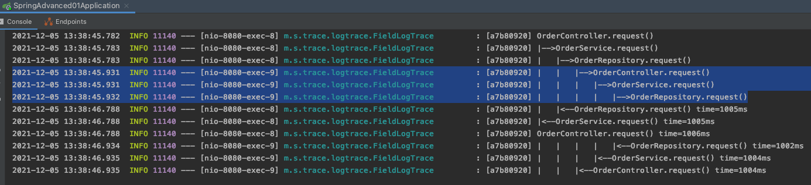
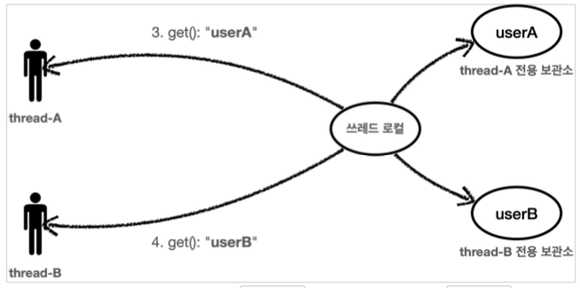
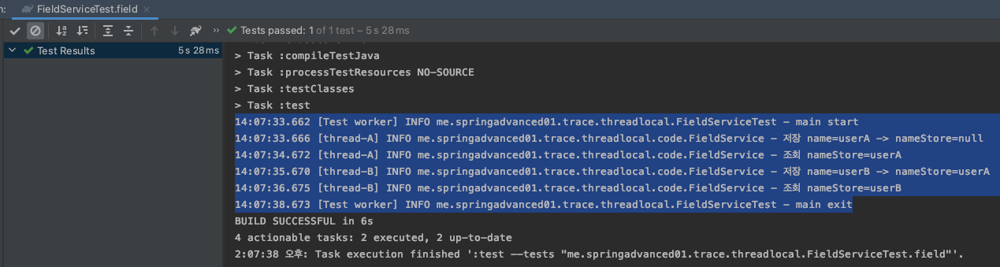
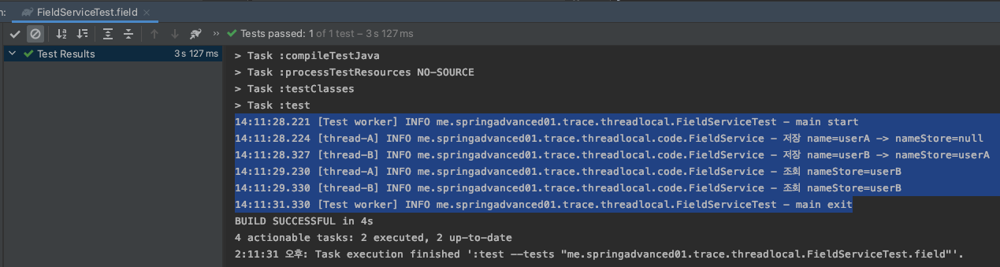
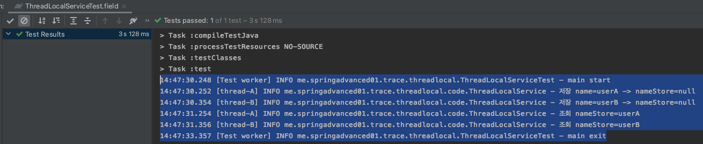
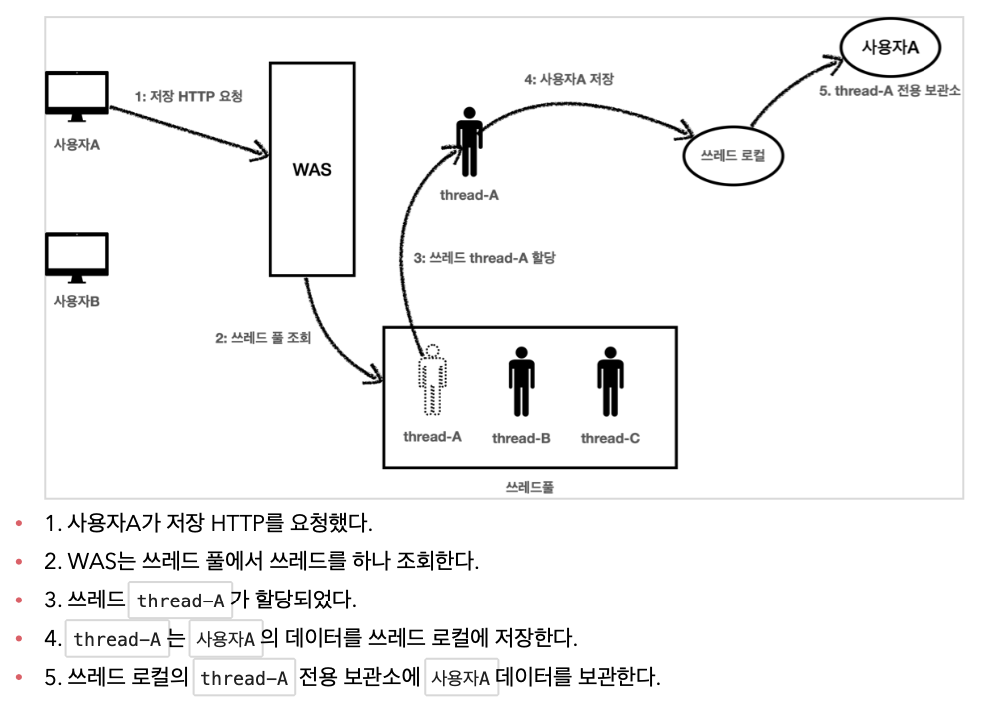
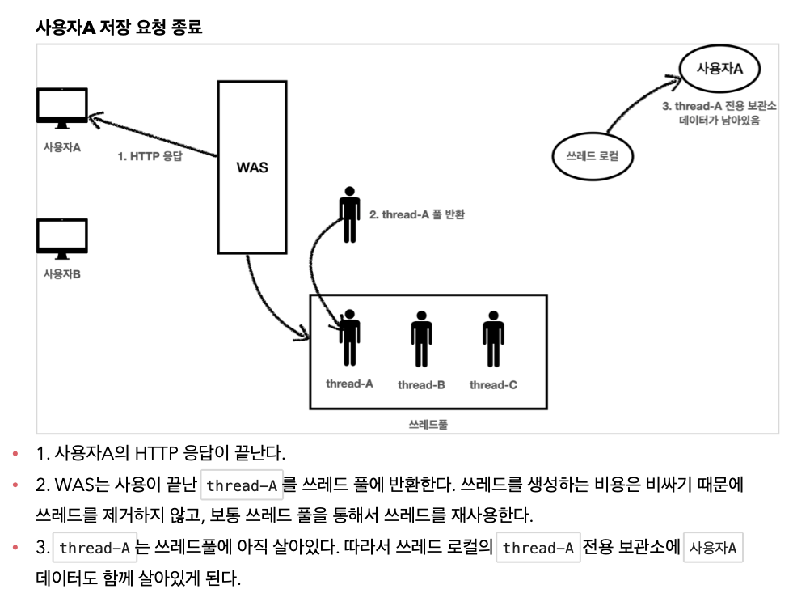
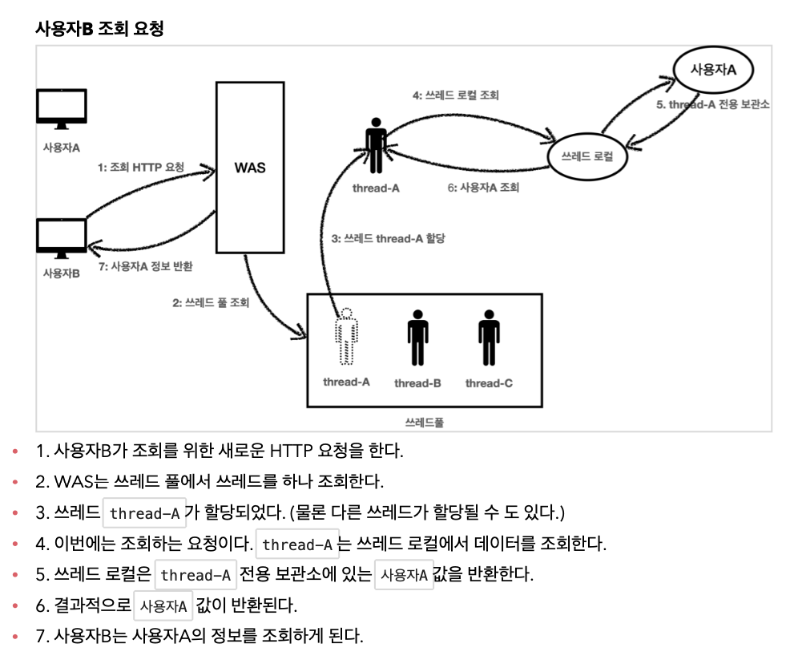
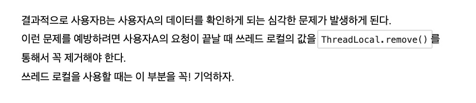

 

# 스프링 핵심 원리 - 고급편 
 

# ThreadLocal
 

### 동시성 문제 
 
  

### ThreadLocal이란
 
  

### ThreadLocal 실험 
#### ThreadLocal 사용 전
 
 
#### ThreadLocal 사용 후 
 
  

### ThreadLocal 사용 시 반드시 주의해야 할 점 
 
 
 
 
  

##### * ThreadLocal에 세션 저장해서 사용하기 
https://velog.io/@skygl/ThreadLocal

  

